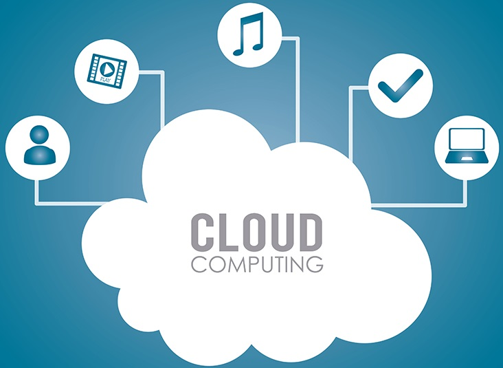
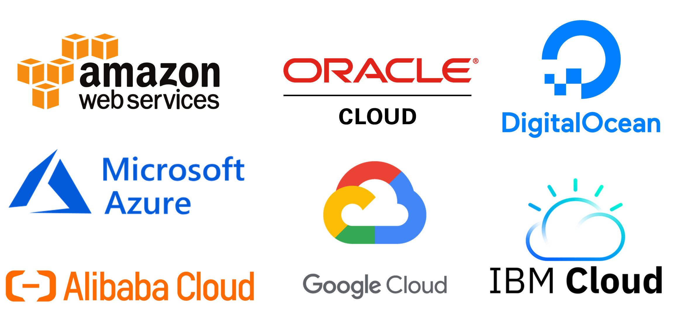

# 🤖**Reto semana uno IA Innovacción Virtual**☁️

## ÍNDICE
* [ ] [👾 La nube, ¿Qué, cuándo y cómo?.](#-La-nube-qué-cuándo-y-cómo)
* [ ] [👾 Servicios de nube.](#-Servicios-de-nube)
* [ ] [👾 Ventajas y desventajas de la nube.](#-Ventajas-y-desventajas-de-la-nube)
* [ ] [👾 Tipos de servicio.](#-Tipos-de-servicio)
* [ ] [👾 Empresas que usan servicios en la nube.](#-Empresas-que-usan-servicios-en-la-nube)
* [ ] [👾 Modelos de servicio en la nube.](#-Modelos-de-servicio-en-la-nube)

## 👾 La nube, ¿Qué, cuándo y cómo?

## 👾 Servicios de nube

### -Amazon WS ☁️:
Amazon Web Services proporciona una plataforma de infraestructura escalable, de confianza y de bajo costo en la nube que impulsa cientos de miles de negocios de 190 países de todo el mundo. Con centros de datos en Estados Unidos, Europa, Brasil, Singapur, Japón y Australia.
[Saber mas de Amazon WS...](https://aws.amazon.com/es/)

### -Azure ☁️:
La nube de Microsoft se presenta como una solución para el campo empresarial que requiere trasladar toda su información tecnológica (sistemas, aplicaciones y software) a la nube, espacios virtuales donde pueden disponer de sus herramientas (con conexión a internet) sin ningún inconveniente.

Microsoft Azure ayuda en la optimización de la gestión de trabajo para implementar y administrar aplicaciones, así como almacenar y analizar bases de datos ágil y eficientemente.
[Saber mas de Azure...](https://azure.microsoft.com/es-mx/free/)

### -Google cloud ☁️:
Google Cloud (Google Cloud) reduce la complejidad y ofrece soluciones que permiten satisfacer tus necesidades de almacenamiento, estadísticas, macrodatos, aprendizaje automático y desarrollo de aplicaciones. Gracias al uso de miles de kilómetros de cable de fibra óptica y a las avanzadas redes definidas por software, la red global de Google ofrece resultados rápidos, coherentes y escalables.
[Saber mas de Google cloud...](https://cloud.google.com/)

### -IBM cloud ☁️:
IBM y VMware han unido fuerzas para simplificar el proceso de desarrollo. Con sus herramientas y tecnología, se puede extender fácilmente las cargas de trabajo VMware de un entorno en local a IBM Cloud de alto rendimiento. Basada en los proyectos de código abierto más populares del mundo, IBM® Cloud es una plataforma cloud que permite a los desarrolladores crear y ejecutar aplicaciones y servicios modernos. Proporciona a los desarrolladores acceso instantáneo a los sistemas y servicios que necesitan: móviles, Internet de las cosas, Watson, etc. 
[Saber mas de IBM cloud...](https://www.ibm.com/mx-es/cloud)

### -Alibaba cloud ☁️:
Alibaba Cloud, también conocida como AliCloud, ofrece una gama de servicios de infraestructura, plataforma y aplicaciones en numerosas áreas. Dichas ofertas incluyen servicios de almacenamiento, red, base de datos, análisis, seguridad y plataforma de aplicaciones.
[Saber mas de Alibaba cloud...](https://us.alibabacloud.com/)

## 👾 Ventajas y desventajas de la nube

El Cloud Computing, la tendencia que utiliza sistemas informáticos compartidos en red para realizar tareas bajo demanda, se ha convertido en la base de este nuevo mundo empresarial, por ser una plataforma que permite el desarrollo ágil de negocios.
La infraestructura basada en este modelo es clave para brindar acceso flexible y bajo demanda a los recursos que sustentan estas nuevas ofertas de negocios digitales. Ésta permite a las organizaciones escalar según sea necesario para soportar las operaciones comerciales que cambian constantemente, al tiempo que reduce los riesgos de sobrecostos y capacidad ociosa en los recursos de TI.
A pesar de que es una tendencia predominante, no todos están convencidos. Por lo tanto, si aún no has integrado servicios de Cloud en tu negocio, destacamos las ventajas y desventajas de este esquema para ayudarte a tomar una decisión:

### Ventajas
•	Reducción de costos
Cuando se trata de las ventajas y desventajas de la computación en la Nube, ésta es la parte superior de la lista para la mayoría de las empresas.

El proveedor asume todas las molestias asociadas con la infraestructura, el mantenimiento y la administración de servicios para los servidores. Las aplicaciones basadas en la Nube suelen ser una fracción del costo del software instalado localmente.

También, tiene la ventaja de pagar sólo por el tiempo o espacio del servidor que utiliza.
•	Confianza
Los proveedores de la Nube construyen arquitecturas con redundancia como primer principio. En el Cloud tus datos no sólo se almacenan en un servidor sino en varios servidores.
Dependiendo del proveedor, incluso los datos podrían almacenarse en servidores en múltiples ubicaciones por si hay una falla catastrófica en una granja de servidores determinada.
Esto significa que ninguna falla de hardware por sí sola afectará el negocio. También, significa que puede esperar una excelente confiabilidad en términos de acceso a sus datos o servicios. La mayoría de los proveedores incluso garantizan un tiempo de actividad del 99.9% al 99.999%.
•	Seguridad
¿La Nube es segura? Sí. Existen mecanismos para asegurar esto. Un método de autenticación es especialmente seguro si para desbloquearlo se requiere además de una contraseña al menos otro parámetro. Se habla entonces de autenticación de dos o múltiples factores, entendida como la medida más eficaz para garantizar la seguridad de acceso a la Nube.
Es por este motivo que se recomienda su uso en ámbitos con un alto riesgo de seguridad. Junto a la combinación de diferentes claves también existe la posibilidad de utilizar contraseñas de un solo uso o la de integrar un objeto en el proceso de autenticación, por ejemplo, una memoria USB.
•	Visión
La próxima generación de tecnologías (por ejemplo, realidad aumentada, inteligencia artificial, automatización, IoT, etc.) se basa en la Nube. Entonces, si deseas mantenerse al día con la competencia (o incluso adelantarse al resto), debes hacer el cambio a la Nube.

### Desventajas
•	Dependiente de Internet
La computación en la Nube requiere una conexión a Internet robusta. Para algunas organizaciones, particularmente en áreas rurales, el uso de servicios de computación en la nube no es una opción factible.
Sin embargo, 5G promete internet de alta velocidad para todos, sin importar dónde se encuentre un negocio. Entonces, 5G podría ser el eslabón perdido para las empresas que desean capitalizar el poder del Cloud Computing pero que aún no han podido hacerlo.
•	Dependencia
Hay un temor generalizado cuando se aborda la Nube: verse obligado a usar un proveedor en particular. También es una preocupación constante el no tener control sobre su infraestructura y datos.
Sin embargo, el socio adecuado se asegurará de que siempre mantengas el control. De hecho, cambiar entre nubes debería ser mucho más fácil que migrar desde un sistema propietario.
•	Complejidad de configuración
Existe la preocupación de que la Nube no sea tan personalizable. Sin embargo, cualquier cosa que pueda ser un requerimiento de datos, aplicaciones o software en general debe ser posible con el proveedor adecuado.
De hecho, a menos que se esté lidiando con requisitos o regulaciones increíblemente complejas, esta tecnología es adecuada para las necesidades de la mayoría de las organizaciones.

## 👾 Tipos de servicio
Pública, privada, mixta...

## 👾 Empresas que usan servicios en la nube
Netflix, spotify

## 👾 Modelos de servicio en la nube

| Modelo | Significado                 | Descripción |
| :---   | :---                        | :---        |
| IaaS   | Infrastructure as a service | Hospedar    |
| PaaS   | Platform as a service       | Construir   |
| SaaS   | Software as a service       | Consumir    |

| Iaas                                  | PaaS                                       | SaaS                                            |
| :---                                  | :---                                       | :---                                            |
| Servicios para arquitectos cloud.     | Plataforma para programadores.             | Software para el usuario final.                 |
| Servidores, networking firewall, etc. | Permite desplegar aplicaciones.            | No se instala, se usa desde el navegador o app. |
| Diseño de la solución a medida.       | No hay que preocuparse de infraestructura. | No se requieren grandes conocimientos técnicos. |
